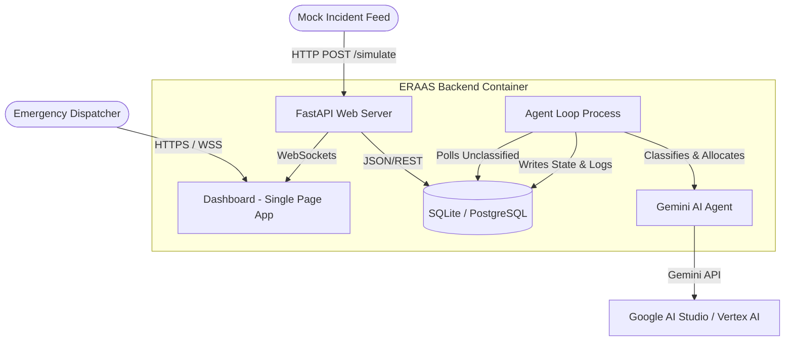

# ERAAS Architecture

This document describes the upgraded ERAAS system architecture using the C4 Container Model.

## Context and Container Diagram

## Upgraded Components

1. **Configuration Management**: Uses `pydantic-settings` to enforce schema validation on startup for environmental variables like `DATABASE_URL` and `GOOGLE_API_KEY`.
2. **Database Layer**: Standardized SQLAlchemy 2.0-style declarative mapping with optimal connection pooling configurations, maintained in `database.py`.
3. **Observability & Logging**: Centralized logging via `loguru`. The API features a custom Starlette Middleware to inject a unique `X-Correlation-ID` across HTTP requests and contextual thread execution.
4. **Agentic Core Hardening**: The agent integration uses `pydantic` schemas natively mapped to the Gemini API's structured JSON output mode, removing fragile regex-based parsing. The core loop features exponential backoff retry-and-recovery handlers.
5. **Automated Testing Suite**: A robust `pytest` suite tests LLM response parsing, allocation routing algorithms, and API endpoints ensuring no regressions occur in production environments.
